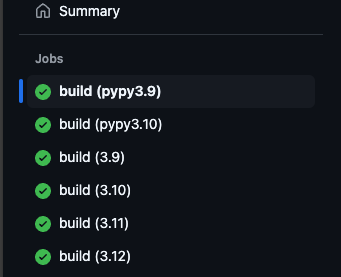

# Mini Project 4: Github Actions Matrix Build for Multiple Python Versions

## Citations:

The [Build and testing Python](https://docs.github.com/en/actions/use-cases-and-examples/building-and-testing/building-and-testing-python) repository was used to establish the workflow for this project. 

## Purpose:

The purpose of this project is to establish a GitHub Actions Workflow to test across multiple Python versions. 

## Requirements:

1. Set up a Gitlab Actions workflow and test across at least 3 different Python versions

2. Correctly configured Github Actions Matrix 

## Contents

- requirements.txt
- Makefile
- devcontainer
- Github Actions
- Docker File
- Main file
- Test File
  
